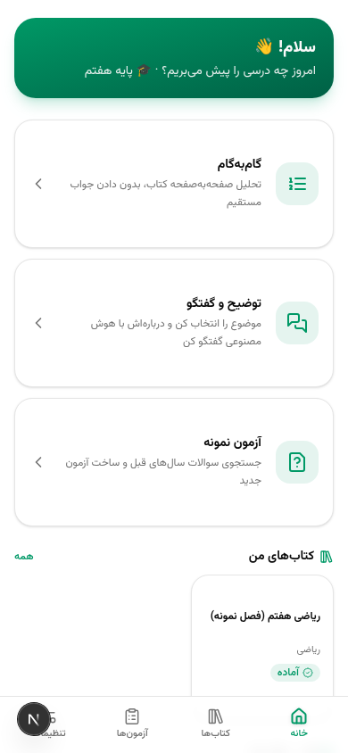
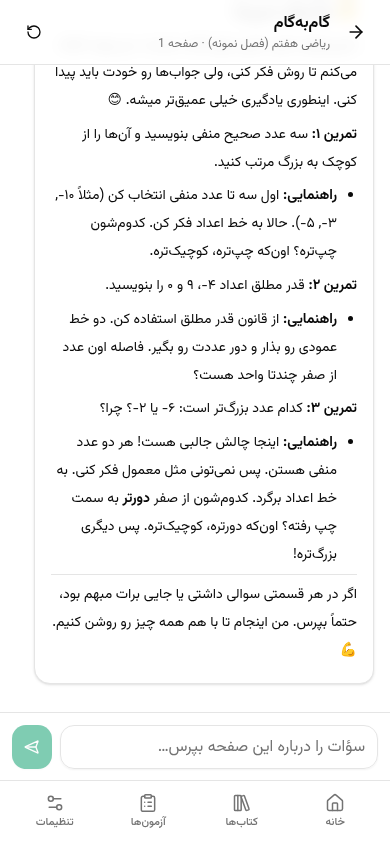
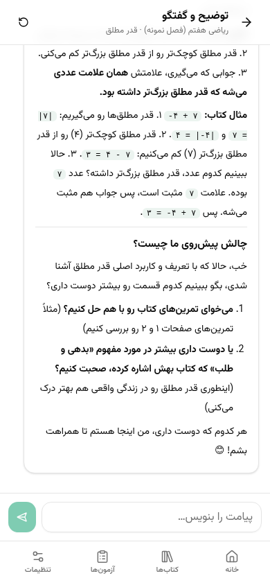
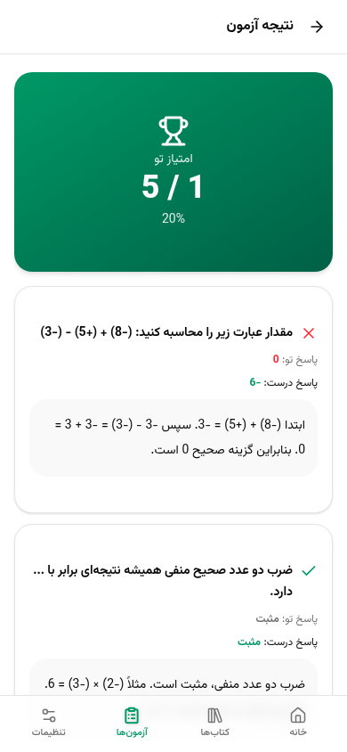

<div align="center">

# 🎓 Tarven — AI Study Tutor


**A bilingual (Persian 🇮🇷 / English 🇬🇧) AI tutor that turns any textbook into a personal teacher — it never gives you the answer, it teaches you how to get there.**

</div>

---

Tarven is a mobile-first tutoring app. Upload a textbook (PDF/TXT), and Tarven analyzes it page by page, then helps you study through three guided modes: **Step-by-Step page analysis**, **topic-based explanation chat**, and **sample tests generated from past exam questions found on the web**.

## ✨ Features

- 🪜 **Step-by-Step Page Analysis** — pick a page from your book and the tutor walks you through it one step at a time: hints, guiding questions, and explanations — *without ever handing you the direct answer*.
- 💬 **Explanation Chat** — chat about any topic from the book, grounded in the detected lessons so answers stay relevant to *your* textbook.
- 📝 **Sample Tests** — Tarven searches the web for past exam questions on the topic and builds an interactive quiz, with scoring and per-question explanations at the end.
- 🌍 **Bilingual & RTL-aware** — full Persian (RTL) and English (LTR) UI with proper layout direction switching, plus a bilingual tutor that answers in your chosen language.
- 📄 **Textbook Upload** — PDF (parsed per page with `pdf-parse`) or TXT (with page markers); lessons are auto-detected per chapter.
- 🧪 **Demo AI built in** — works out of the box with the bundled `z-ai-web-dev-sdk`; plug in any OpenAI-compatible API key for your own model.
- 📱 **Installable Android APK** — a tiny WebView shell (`android-shell/`) is built and released automatically by GitHub Actions.
- 🎨 **Mobile-first UI** — emerald theme, Vazirmatn font, bottom navigation, built with shadcn/ui.

## 🛠 Tech Stack

| Layer | Tech |
| --- | --- |
| Frontend | Next.js 16 (App Router, SPA-style screens), TypeScript, Tailwind CSS, shadcn/ui, Zustand |
| Backend | Next.js API routes, Prisma ORM + SQLite |
| AI | `z-ai-web-dev-sdk` (demo AI) or any OpenAI-compatible API key |
| Parsing | `pdf-parse` for per-page textbook extraction |
| Mobile | Android WebView shell (Java, minSdk 24) + GitHub Actions release CI |

## 🚀 Getting Started

### Prerequisites

- **Node.js 20+** or **[Bun](https://bun.sh)** 1.x
- (Optional) an OpenAI-compatible API key — not required, the demo AI works without it

### Install & run

```bash
bun install        # or: npm install
bun run db:push    # create/sync the SQLite database (Prisma)
bun run dev        # start the dev server
```

Then open **http://localhost:3000**.

### Onboarding

The first-run wizard asks for three things:

1. **Language** — Persian (RTL) or English (LTR)
2. **API key** — optional; skip it and Tarven uses the built-in demo AI
3. **Grade** — personalizes explanations and generated tests

You can change all of these later in **Settings**.

## 📚 Building Your Textbook

1. Go to **Books** → upload a **PDF** or **TXT** file (TXT files can use page
   markers; PDFs are split page-by-page automatically).
2. Tarven analyzes each page and auto-detects **lessons/chapters** — this may
   take a moment on large books.
3. Open the book to browse detected lessons or jump to any page and start a
   **Step-by-Step** session.
4. From a lesson, launch **Explanation Chat** or generate **Sample Tests**
   (built from past exam questions found via web search).

## 📱 Mobile App (APK)

`android-shell/` contains a minimal Android WebView shell (Java, no
dependencies) that wraps the deployed web app — it asks for your server URL on
first launch, supports PDF upload, and shows a retry page on network errors.
See [`android-shell/README.md`](android-shell/README.md) for details.

**Automatic builds via GitHub Actions** — `.github/workflows/build-apk.yml` builds the APK on every release:

```bash
git tag v1.0.0
git push origin v1.0.0
```

Push a tag like `v1.0.0` and the workflow builds the APK with Gradle 8.7 / JDK 17 on `ubuntu-latest`, renames it to `Tarven-v1.0.0.apk`, uploads it as a workflow artifact, and attaches it to the GitHub Release (`softprops/action-gh-release`). You can also trigger it manually from the **Actions** tab (▶ *Run workflow*).

**Build locally:** open `android-shell/` in Android Studio and hit ▶, or run
`gradle assembleDebug` inside `android-shell/`.

## 🖼 Screenshots

| | |
| --- | --- |
|  |  |
| *Home* | *Step-by-Step page analysis* |
|  |  |
| *Explanation chat* | *Sample test results* |

More screenshots live in the [`screenshots/`](screenshots/) folder.

▶ **Watch the full demo video** (recorded walkthrough of all features):
[`screenshots/video/Tarven-final.mp4`](screenshots/video/Tarven-final.mp4) — also attached to the GitHub releases.

## 🗂 Project Structure

```
tarven/
├── src/
│   ├── app/                    # Next.js App Router entry + API routes
│   │   └── api/                # settings, books, tutor/{step,explain,test,hint}
│   ├── components/
│   │   ├── screens/            # onboarding, home, books, tutor-chat, tests, settings
│   │   └── ui/                 # shadcn/ui components
│   ├── lib/                    # i18n (fa/en), AI clients, prompts, PDF parsing,
│   │                           # retrieval, sample book, Zustand store
│   └── hooks/
├── prisma/schema.prisma        # Settings, Book, Page, Lesson, ChatThread, GeneratedTest
├── db/                         # SQLite database (kept via .gitkeep)
├── android-shell/              # Android WebView shell (APK wrapper)
├── .github/workflows/          # build-apk.yml — tag-driven APK release CI
└── screenshots/                # app screenshots
```

## 📄 License

Released under the [MIT License](https://opensource.org/licenses/MIT).

## 🙏 Credits

- [Next.js](https://nextjs.org) · [Tailwind CSS](https://tailwindcss.com) · [shadcn/ui](https://ui.shadcn.com) · [Prisma](https://www.prisma.io)
- [Vazirmatn](https://github.com/rastikerdar/vazirmatn) font for Persian text
- Built with the z-ai-web-dev-sdk demo AI, or bring your own OpenAI-compatible key.
